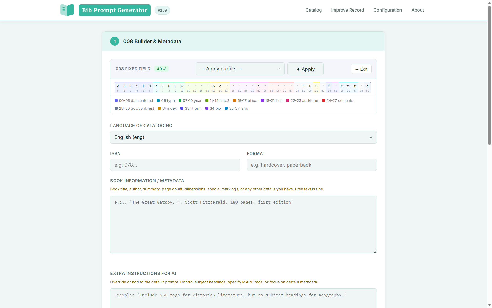

# Bibliographic Record AI Prompt Generator

An easy-to-use tool designed to help library staff generate, validate, and send AI-assisted MARC bibliographic records directly to OCLC WorldCat without repetitive manual copy-pasting.



---

## Quick Start & Installation

Choose **Option A** (recommended for automatic updates) or **Option B**.

### Option A: Install with Git (Recommended)

1. Open your computer's **Terminal** (Mac/Linux) or **Command Prompt / PowerShell** (Windows) in the folder where you want to store the application permanently. *(Do not move this folder later, or you will need to re-install.)*
2. Run this command:
```bash
git clone https://github.com/marisabelmunoz/Bib-Title-Generator.git

```

### Option B: Download Directly

1. Download the project `.zip` file from GitHub.
2. Extract (unzip) the folder into a permanent location on your computer.

### Final Setup (Both Options)

1. Open the extracted or cloned folder.
2. Right-click inside the folder and select **Open in Terminal** (or navigate to this folder in your terminal).
3. Type `python install.py` and press **Enter**.
4. Wait for setup to finish. (If the shortcut ever stops working, simply run `python install.py` again).
5. Move the newly created shortcut to your **Desktop** or **Taskbar**.
6. Double-click the shortcut to open the tool in your web browser.
7. Open the **About** page inside the app for initial setup instructions.

---

## Background & Purpose

Coming from a background in software development and hotel guest experience, I am always looking for ways to streamline workflows and reduce repetitive tasks.

During our university library's adoption of AI for cataloging, I noticed catalogers were constantly asking AI models to format bibliographic records based on books in hand, only to manually copy and paste each field line-by-line into our catalog.

A colleague asked: *"I wish I could just send this directly to the catalog."*

This app makes that possible.

> **Why use a desktop shortcut?**
> Many institution devices prevent users from installing standard software (`.exe`) or running shell scripts (`.sh`). Using a local Python script launched via a desktop shortcut works safely within these IT permissions.

---

## How It Works

The application runs a lightweight local web server (`app.py`) directly on your computer. When launched, it automatically opens a user-friendly control panel in your default web browser. No complex server setup or technical knowledge is required.

---

## Interface Overview

### Catalog View (Create New Records)

* **008 & Leader (LDR) Builder:** Fill out fixed fields manually using guided forms. (AI often misinterprets empty spaces, which breaks MARC structure). You can save template profiles for frequent record types in **Configuration**.
* **Reusable Prompts:** Add default cataloging rules to your AI prompts automatically so you don't have to retype instructions every time.
* **Paste MARCXML from AI:** Paste the XML code generated by your AI tool here.
* **Validate MARCXML:** Checks your record against RDA rules, MarcEdit standards, and the OCLC Validation API before uploading.
* 🔴 **Red Warning:** Critical error. Must be fixed before submitting.
* 🟡 **Yellow Warning:** Cautionary note. The record can be created, but field details should be verified.


* **Preview MARC21:** Translates raw XML into a clean, readable MARC21 format for easier reviewing.
* **Create Record in WorldCat:** Sends the validated record straight to OCLC using the [WorldCat Metadata API](https://developer.api.oclc.org/wc-metadata-v2#/).

*Note: You do not need an OCLC API key to use the tool. You can still use it to format and validate records manually for Record Manager or other ILS systems.*

### Improve Record View (Update Existing Records)

* **Load Record from WorldCat:** Fetches an existing MARC record using its OCLC number.
* **Generate Improvement Prompt:** Specify what fields need updating. Prompts instruct the AI to **only append new information** without overwriting existing data.
* **Paste & Update:** Review and validate the updated record before sending changes back to WorldCat.

### Configuration View (Settings)

* **Institution Configuration:** Set up your library ID/OCLC symbol (required).
* **API Credentials:** Store your OCLC API details safely with built-in encryption. *(If overwritten, re-enter your credentials here.)*
* **Leader (LDR) & 008 Profiles:** Create default templates for fixed fields.
* **Custom Prompts:** Save frequently used AI instructions.

### About View

* Check for updates (if installed via Git).
* Access technical documentation and MARC reference guides.
* Manage custom encryption keys.
* View monthly OCLC API usage limits.

## On Updates:
on the top bar, if you isntalled using `.git`, you will be notified of any updates, which will happen automatically once you accept (feel free to review the code before you do.)